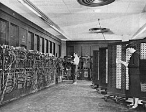

    

<h1 align="center">Formatando Mainframe.</h1>

### Objetivo

Profissionais de tecnologia com mais de 40 anos, que não estejam trabalhando atualmente e que queiram atualizar os seus conhecimentos de infraestrutura e conhecer a cultura DevOps.

*"Panela velha é que faz comida boa"* - **Reis, Sergio**.

### O que esperamos
É um programa que transforma antigos conhecimentos de infraestrutura, para infraestrutura de computação na nuvem.

### O que oferecemos
- [x] Estudo remoto
- [x] Voucher com os cursos do programa
- [x] Camisa personalizada do programa
- [x] Estágio não remunerado

Venha fazer parte!

Faca sua inscrição [**aqui**](https://forms.gle/3AtVVZXm68fJzRXt7).
