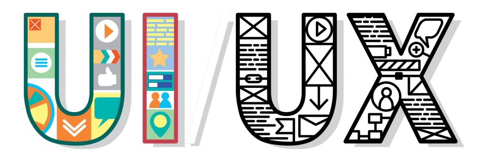

    

<h1 align="center">Seja nosso especialisa.</h1>

### Objetivo

Aqui você encontra os requisitos para usar sua criatividade e aplicar todo seu conhecimento, seja nosso especialista em usabilidade e interfaces 

*“Que a Força esteja com você.”* - **Star Wars**

### Case
Sou um vendedor ambulante, fico pelas praias de Vila Velha-ES vendendo meu produto, meu público-alvo são os turistas e frequentadores destas praias, preciso desenvolver um app para mostrar as pessoas onde estou e quais são meus produtos; tendo em vista que o app precisa de: um login social, cadastro de produtos, cadastro de itens e localização por GPS.

### O que esperamos
Que utilize das técnicas de usabilidade para determinar a experiencia do usuário e que crie um protótipo funcional para avaliarmos o seu conhecimento.

### Como esperamos
Você terá **10** dias para enviar um protótipo de alta fidelidade, utilizando plataformas de prototipagem como figma, XD ou semelhantes, que será enviado ao email vagas@optsol.com.br com o assunto "[UI/UX]-[SEU NOME] [CIDADE]".

### O que oferecemos
- [x] Trabalho remoto
- [x] Horário flexivel
- [x] Regime CLT ou PJ
- [x] Remuneração Compativel com o Mercado.

Sinta-se a vontade para nos enviar seu portifólio.
